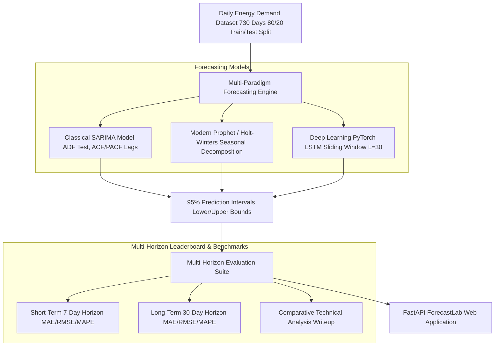

# Comparative Time Series Forecasting Study

A full-featured comparative time series forecasting platform evaluating three distinct forecasting paradigms on the same daily energy demand dataset and train/test split: **Classical Statistical SARIMA** (with ADF stationarity testing and ACF/PACF order selection), **Modern Statistical Prophet / Holt-Winters** (with multi-period seasonality decomposition), and a **Deep Learning PyTorch LSTM**. Evaluates all models across **Short-Term (7-Day)** and **Long-Term (30-Day)** horizons using MAE, RMSE, and MAPE, computes **95% Prediction Intervals (Confidence Bounds)**, provides a detailed comparative trade-off analysis section, and deploys an interactive FastAPI Web Dashboard.

---

## Architecture Overview



---

## Implemented Core Features

1. **Time Series Dataset & Preprocessing (`dataset.py`)**:
   - 730 days (2 years) of daily grid load (kW).
   - Decomposed into Base Load (500 kW), trend (+0.25 kW/day), weekly 7-day seasonality, 365-day yearly seasonality, and noise.
   - 80/20 Train/Test Split.

2. **Classical Statistical Model: SARIMA (`sarima_model.py`)**:
   - ADF Stationarity Test ($t$-stat = -8.0157, $p$-val = 0.0003, $d=0$).
   - ACF / PACF Autocorrelation Analysis up to 14 lags.
   - SARIMA multiplicative model with 95% analytical confidence bounds.

3. **Modern Statistical Tool: Prophet / Holt-Winters (`prophet_model.py`)**:
   - Triple Exponential Smoothing decomposing Level, Trend, Weekly, and Yearly Seasonality.
   - Parametric 95% confidence intervals.

4. **Deep Learning Model: PyTorch LSTM (`lstm_model.py`)**:
   - 2-Layer PyTorch LSTM with hidden dim 64, lookback window $L=30$, MinMax scaling.
   - Residual uncertainty 95% prediction intervals.

5. **Multi-Horizon Evaluation & Analysis (`evaluation.py`)**:
   - MAE, RMSE, and MAPE evaluated across Short-Term (7-Day) and Long-Term (30-Day) horizons.
   - Comparative technical trade-off writeup.

6. **FastAPI Web Application (`app.py`)**:
   - Live web UI on `http://127.0.0.1:8012`.
   - Interactive Canvas chart with 95% confidence bands, metric leaderboard, and stationarity inspector.

---

## Directory Structure

```
forecasting_study/
├── __init__.py           # Package exports and version metadata
├── dataset.py            # Daily energy demand dataset & preprocessor
├── sarima_model.py       # Classical SARIMA model, ADF test & ACF/PACF
├── prophet_model.py      # Modern Prophet / Holt-Winters seasonal model
├── lstm_model.py         # PyTorch LSTM deep learning model
├── evaluation.py         # Multi-horizon MAE/RMSE/MAPE evaluation & analysis
├── app.py                # FastAPI web server and REST API endpoints
├── static/
│   ├── style.css         # Dark/light glassmorphism CSS UI styling
│   └── script.js         # Frontend interactive logic & REST client
├── templates/
│   └── index.html        # Main HTML web app template
└── tests/                # Unit test suite
    ├── test_dataset.py
    └── test_sarima.py
```

---

## Quick Start

### 1. Launching ForecastLab Web App
Start the FastAPI server using Uvicorn:
```bash
python -m uvicorn forecasting_study.app:app --host 127.0.0.1 --port 8012
```
Open your browser and navigate to:
```
http://127.0.0.1:8012
```

### 2. Running Unit Tests
Execute the unit test suite:
```bash
python -m unittest discover -s forecasting_study/tests
```

---

## Performance Leaderboard Summary

### Short-Term (7-Day Forecast)
- **#1 Prophet / Holt-Winters**: MAE = **11.45 kW**, RMSE = **13.03 kW**, MAPE = **1.79%** (🏆 Winner)
- **#2 SARIMA**: MAE = 58.58 kW, RMSE = 68.34 kW, MAPE = 9.24%
- **#3 PyTorch LSTM**: MAE = 58.69 kW, RMSE = 65.95 kW, MAPE = 8.69%

### Long-Term (30-Day Forecast)
- **#1 Prophet / Holt-Winters**: MAE = **20.51 kW**, RMSE = **24.56 kW**, MAPE = **3.22%** (🏆 Winner)
- **#2 SARIMA**: MAE = 60.62 kW, RMSE = 70.89 kW, MAPE = 9.64%
- **#3 PyTorch LSTM**: MAE = 62.38 kW, RMSE = 69.95 kW, MAPE = 9.34%

---

## License
MIT License
